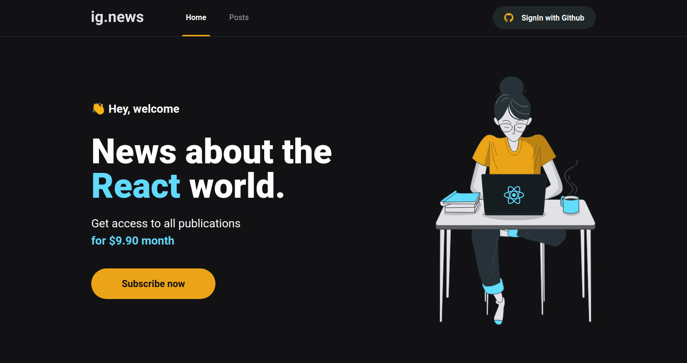
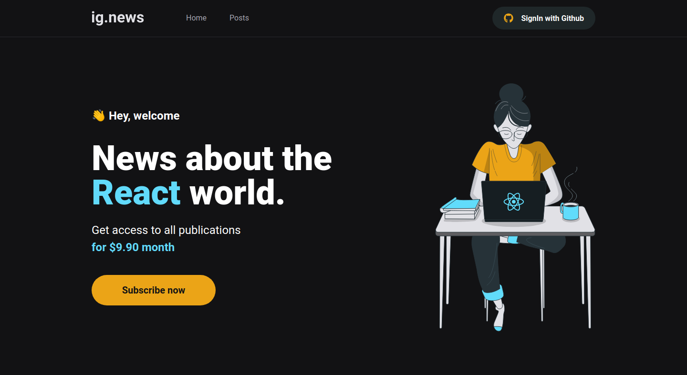
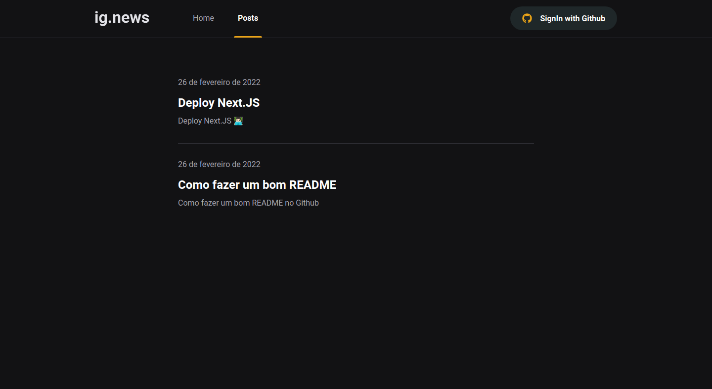
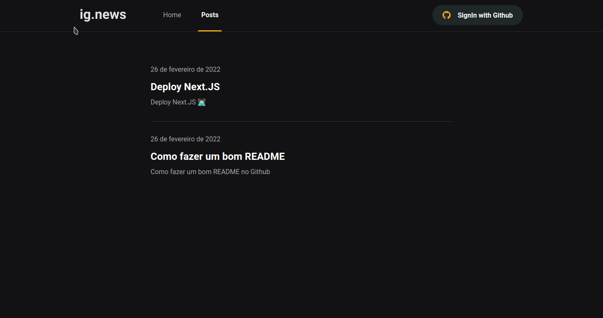

# ignews

<p align="center">
  
</p>

<h2 align="center">
  A subscription blog-like content platform. Built with ReactJS, Next.JS, SASS, 
  Prismic, Stripe and Typescript.
</h2>

<p align="center">
  

  

  <a href="https://github.com/areasflavio/ignews/commits/master">
    
  </a>
</p>

<p align="center">
  <a href="#star-features">Features</a>&nbsp;&nbsp;|&nbsp;&nbsp;
  <a href="#keyboard-technologies">Technologies</a>&nbsp;&nbsp;|&nbsp;&nbsp;
  <a href="#computer_mouse-installation">Installation</a>
</p>






<br/>

# :star: Features

[(Back to top)](#ignews)

This is a subscription blog-like content platform. The user logs in using GitHub
and pays his subscription using Stripe. Users who do not have the subscription,
can only see a few initial paragraphs of the post, offering the subscription below.

Some key features are:

- Functional application with Next.JS with SSR and SSG.
- NextAuth integration for the login part.
- UI built with SASS.
- Integration with Prismic CMS, to work with every part of the blog system.
- Integration with Stripe for the payments part of the subscriptions.
- Subscription verification system, the displayed content is incomplete for users
  without subscription.
- Data is saved in the FaunDB database.
- Many functionalities are cover by tests using Jest and Testing Library.

The application is built using ReactJS with Next.JS framework and SSR and SSG
features. Posts data is provided by Prismic CMS and the user and subscriptions
data are stored in FaunaDB. The user interface is built with CSS. The entire
codebase is written using Typescript.

> Project developed at Chapters III and V of Rocketseat's Ignite bootcamp.

<br/>

# :keyboard: Technologies

[(Back to top)](#ignews)

This is what I used and learned with this project:

- [x] ReactJS
- [x] Next.JS
- [x] Next Auth
- [x] SASS
- [x] FaundaDB
- [x] Prismic CMS
- [x] Stripe
- [x] Axios
- [x] Jest
- [x] Testing Library
- [x] Typescript

<br/>

# :computer_mouse: Installation

[(Back to top)](#ignews)

To use this project, first you need NodeJS running in your device, then you can
follow the commands below:

```bash
# Clone this repository
git clone https://github.com/areasflavio/ignews.git

# Go into the repository
cd ignews

# Install dependencies for the application
yarn install

# Copy the .env.example to the .env file and inject your credentials
cp .env.example .env.local

# To start the development server, run the following command
yarn dev
```

# :man_technologist: Author

[(Back to top)](#ignews)

Build by Flávio Arêas 👋 [Get in touch!](https://www.linkedin.com/in/areasflavio/)
